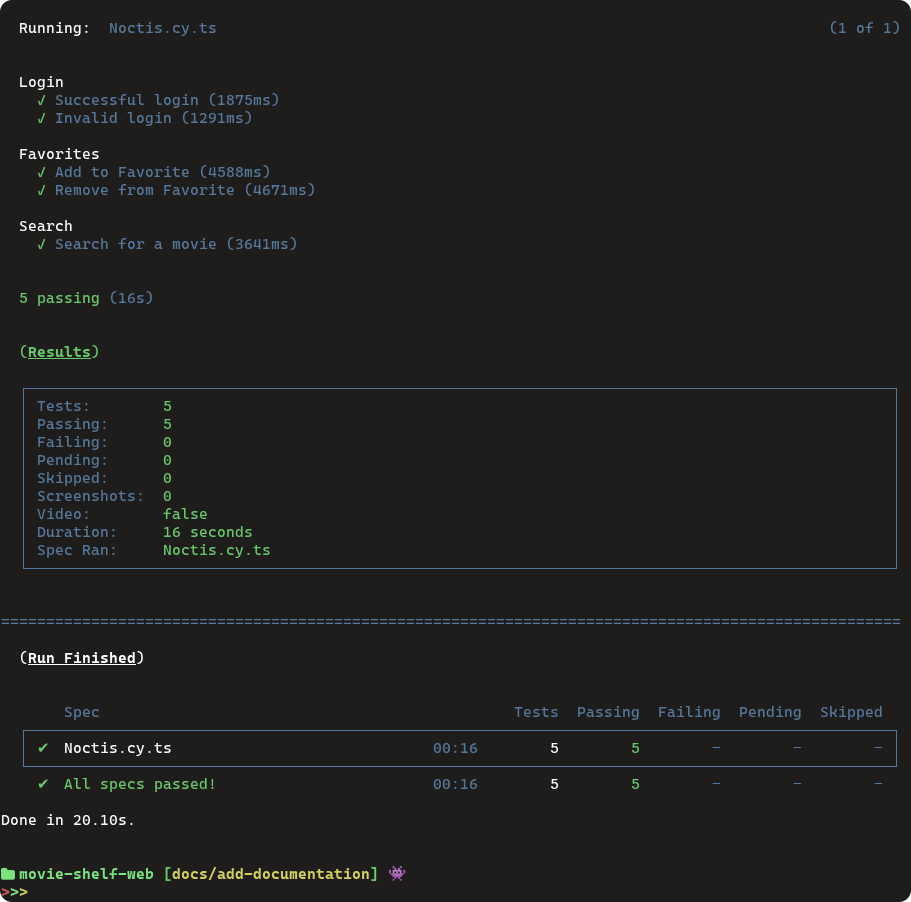

# Noctis

<p align="center">


</p>


<p align="center">


</p>


https://github.com/Noctis3/movie-shelf-web/assets/69818768/9e89d3d6-b35d-45c1-bd9d-8bc47ed073d0


> Noctis is a web/mobile application that allows users to explore and favorite movies, as well as receive personalized recommendations generated by the OPENAI API based on their favorited movies.


## 🚀 Installation and Execution

To install Noctis, follow these steps:

For Linux, macOS, and Windows:
1. Clone this repository to your local environment.
2. Navigate to the project directory via the terminal.
3. Install dependencies using Yarn:

```sh
   yarn install
```
1. Rename the .env.example file to .env and fill in the necessary environment variables, such as API keys.
2. Run the [backend](https://github.com/Noctis3/movie-shelf-backend)
3. Start the application:
```sh
yarn start
```

## ☕ Automated Testing

Automated tests have been created using Cypress. To run the tests, follow these steps:

Make sure the application is up and running.

In the terminal, within the project directory, execute the following command to initiate the tests:
```sh
yarn cypress run
```


This will run the automated tests and provide results about the application's integrity.

## 🛠️ Used Technologies

- `React` - JavaScript library for building user interfaces.
- `TypeScript` - Programming language for static typing during development.
- `Chakra UI` - Component library for building modern interfaces.
- `Yarn` - Package manager used to install and manage dependencies.
- `i18n` - Library for application internationalization.
- `Cypress` - End-to-end testing framework for automated testing.

## 🤝 Contribuitors


<table>
  <tr>
    <td align="center">
      <a href="https://github.com/luanaccioly">
        <br>
        <sub>
          <b>Luan Accioly</b>
        </sub>
      </a>
    </td>
    <td align="center">
      <a href="https://github.com/atilara">
        <br>
        <sub>
          <b>Átila Rodrigues </b>
        </sub>
      </a>
    </td>
    
  </tr>
</table>

